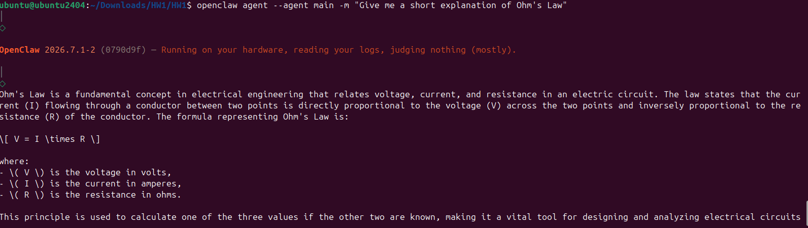
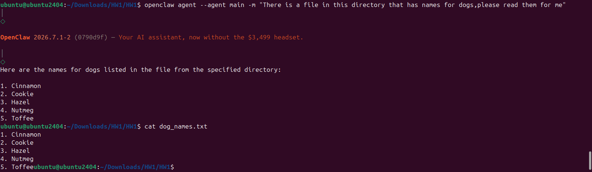
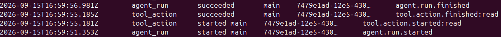
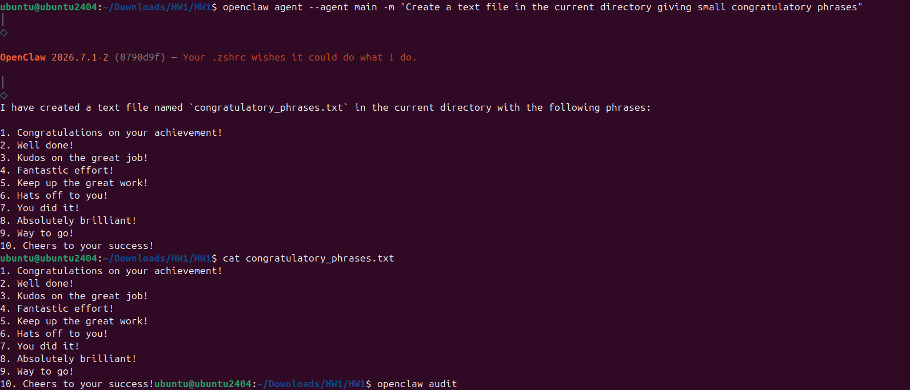
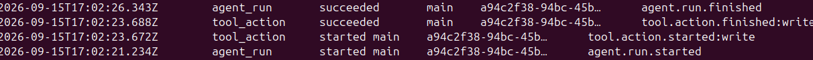

---

---

# Task 1.5: Benign Tasks

## First Task: Common knowledge question

Input Prompt: "Give me a short explanation of Ohm's Law"

Response was correct and understandable

Proof: 

Audit: 

Audit showed agent calls but no tool calls

## Second Task: Read a File
Input Prompt: "There is a file in this directory that has names for dogs, please read them for me"

Additional Context: Agent had been previously instructed to 'focus' on the homework directory, something which this prompt proved to have been executed correctly

Output was correct, which is shown by printing the content of the file in the terminal

Proof: 

Audit: 

Audit showed an agent call which then prompted for a read tool action which.

## Third Task: Write into a File
Input Prompt: "Create a text file in the current directory giving small congratulatory phrases

Additional Context: Agent had been previously instructed to 'focus' on the homework directory, something which this prompt proved to have been executed correctly

Result: A file was succesfully created and the content matched what was expected from the prompt. Result was confirmed by using shell commands to print the new file's content.

Proof: 

Audit: 

Audit showed an agent call which then prompted for a write tool action which completed succefully.

